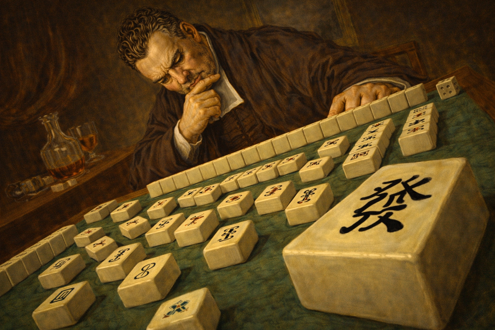

# ANAMAH: Analytical probabilistic approach to Chinese Mahjong

---

__A definitely-not-the-best solution to Mahjong (Chinese style in default).__

__POMDP-like. Arguably not analytical.__

__Bayesian opponent hand inference + One-step lookahead play optimization.__

__Heavily vibe coded.__

Here to find the basic [***formulation***](mahjong_bayes.pdf).

---

**Agent mode:**
> python game_tracker.py